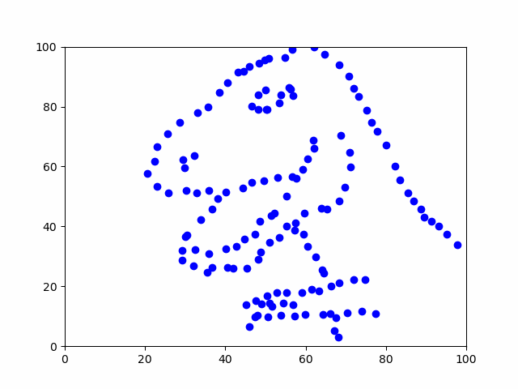

# User Guide

## Introduction
This Repository allows you to import data in form of a 2D point cloud and generate new datasets while maintaining the original statistical properties. It is based on the Project [**Same Stats, Different Graphs**](https://www.autodesk.com/research/publications/same-stats-different-graphs) from Justin Matejka and George Fitzmaurice. Using the C++ programming language and modern programming techniques like vectorization, we managed to speed up the code significantly and achieved a run time of ~0.08s (@100000 iterations). For more information, see [**Generating 2D Datasets with similar statistical properties**](https://github.com/MariusWank/AlgoEngi/blob/main/Paper/paper.pdf).<br>
This is a project for the course 'Algorithm Engineering' from Marius Wank and Veit Hucke - Friedrich-Schiller-University Jena, March 2023.



## Getting started
- [build.sh](https://github.com/MariusWank/AlgoEngi/blob/main/build.sh) is a script to build and compile the project.


- [run.sh](https://github.com/MariusWank/AlgoEngi/blob/main/run.sh) is a script to run and directly visualize the built project.


- [preferences.json](https://github.com/MariusWank/AlgoEngi/blob/main/Project/config/preferences.json) contains all necessary parameters and paths which can be/ have to be adjusted depending on the user.


- [visualization.py](https://github.com/MariusWank/AlgoEngi/blob/main/Project/src/visualization.py) is the script to visualize the temporal data generated within the C++ program.

## Requirements
cmake version 3.25.2, python 3.11.0, pandas 1.5.3, matplotlib 3.7.0, GNU 8.3

*These versions have been used for testing. Support for other versions of the used libraries is not guaranteed.*

## Guide
0. Make sure to have the above-mentioned libraries and tools installed on your computer.
<br>It is recommended to create a new virtual environment for the visualization script. Otherwise, just activate an existing virtual environment that has the necessary python dependencies installed before running the **run.sh** script.<br><br>
1. Build the project using the **build.sh**. In order for this to work, the path to the used compiler has to be given in this script.
<br>On Linux, typing e.g. 'g++' as compiler is sufficient.<br>On MacOS (at least using ARM), the default gcc compiler (which is accessed by also just typing 'g++' as argument) does not support OpenMP and will probably crash. The path to the custom gcc (e.g. installed via brew) needs to be specified.
<br>On Windows, g++ must be set as a compiler.
<br>Also keep in mind that this **build.sh** script may not work for all machines out of the box. Some problems may occur when using Windows, e.g. the build with cmake may fail. As a workaround, we had to use ninja as generator.<br><br>
2. Change the I/O settings in the **preferences.json** so the correct data is imported and later correctly exported again.<br>(Step 1. and 2. are interchangeable of course.)<br><br>
3. Now there are two options:<br>Run the **run.sh** script to execute the *simulated_annealing* binary which creates the new data in form of the *image_data.csv* file. After the new data has been generated, this script directly pipelines the **visualization.py** to generate a simulated_annealing.gif in the target folder specified by *animation_path* in the user preferences.
<br>Alternatively, after building the C++ project, the *simulated_annealing* binary can also be executed manually. Be aware that the binary takes a command line argument, namely the user preferences via **--preferences** keyword. For the same information, you can also run the binary with the **-h** flag. This will only generate the *image_data.csv* file. If a visualization is desired, the **visualization.py** script can be executed manually as well. Again, this scripts needs the *preferences.json* as command line argument.

### Example
First, build the Project:
```
./build.sh
```
Afterwards, run it including visualization:
```
./run.sh
```
Alternatively, run the binary manually:
```
./build/simulated_annealing --preferences ~path/to/config/preferences.json
```
...and/or run the visualization:
```text
python /Project/src/visualization.py ~path/to/config/preferences.json
```

## Preferences user guide
|    Parameter     | Default Value |                                                                  Description                                                                   |
|:----------------:|:-------------:|:----------------------------------------------------------------------------------------------------------------------------------------------:|
|    input_path    |       -       |                                          Path to the .csv/.tsv file that contains the original data.                                           |
|   output_path    |       -       |           Path to the .csv file that, after running the program, will contain the positional data of all points over all time steps.           |
|  animation_path  |       -       |                            Path to the .gif file that will be the video after running the visualization.py script.                             |
|      shape       |    Circle     | Desired target shape to perturb the input data towards.<br/>Choose from [Circle, Bullseye, X, H_lines, V_lines, Dots, High_lines, Wide_lines, Star] |
|    iterations    |    100000     |                          Value that determines the number of iterations for the actual simulated annealing algorithm.                          |
| min_temperature  |     0.01      |                      Minimal temperature that is reached within the cooling scheme for the simulated annealing algorithm.                      |
| max_temperature  |      0.4      |                         Maximal temperature at which the cooling scheme starts for the simulated annealing algorithm.                          |
| allowed_distance |      2.0      |                                   Minimal distance below which we always accept the new state of the system.                                   |
| additional_shake |      0.2      |                                              Maximum amount of movement allowed in each iteration                                              |


